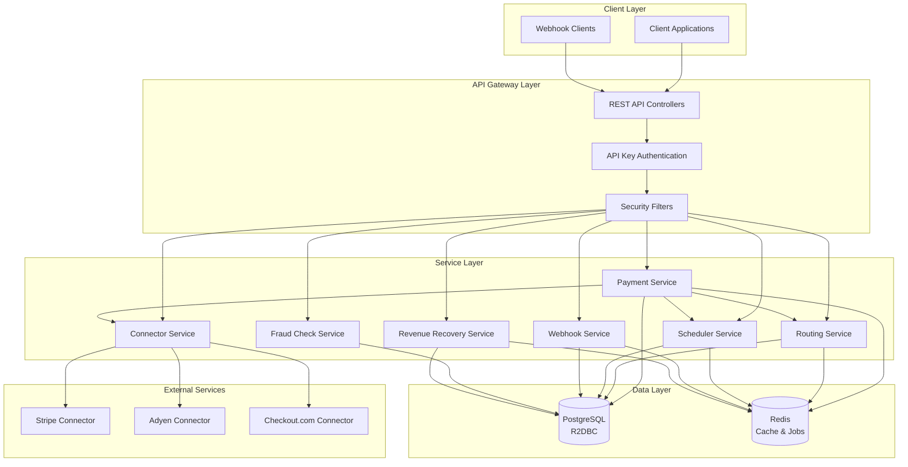
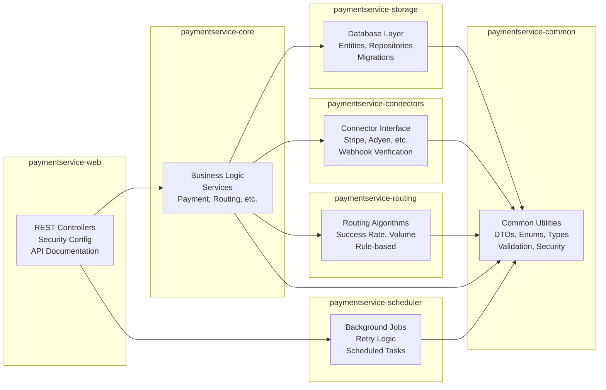
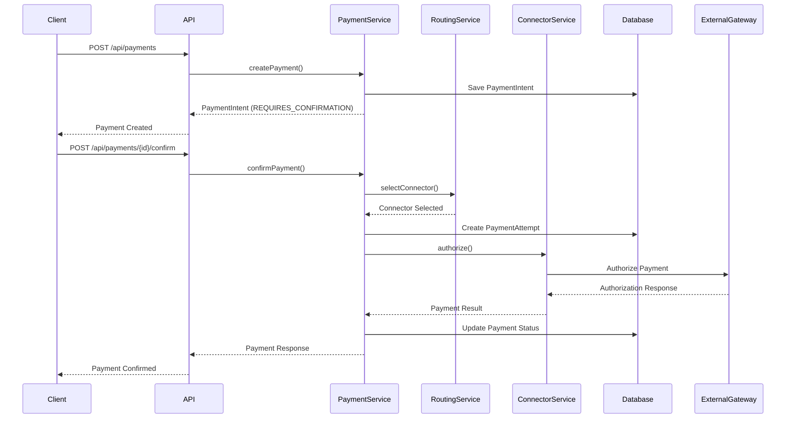
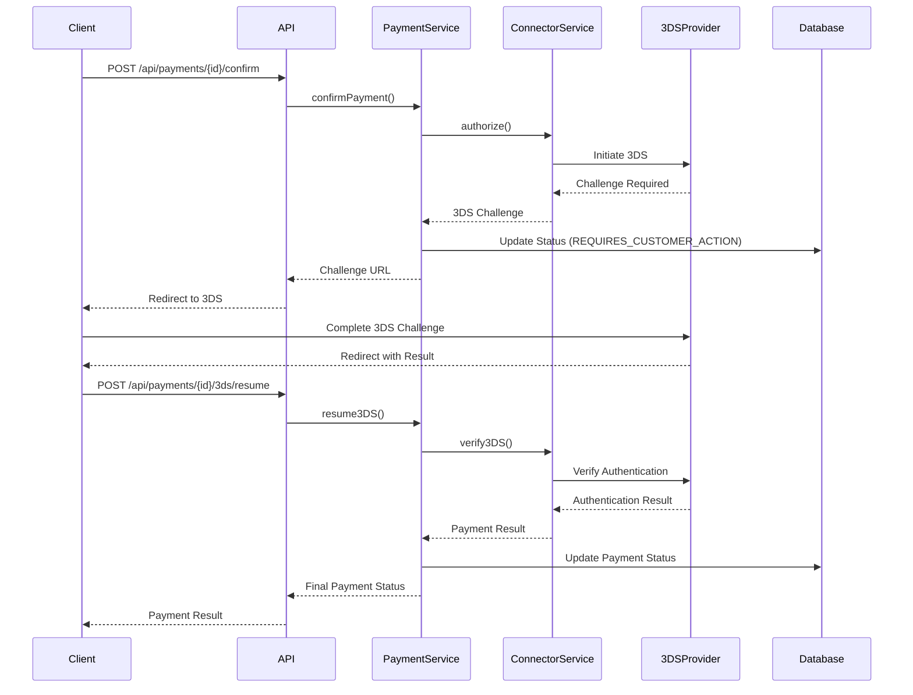
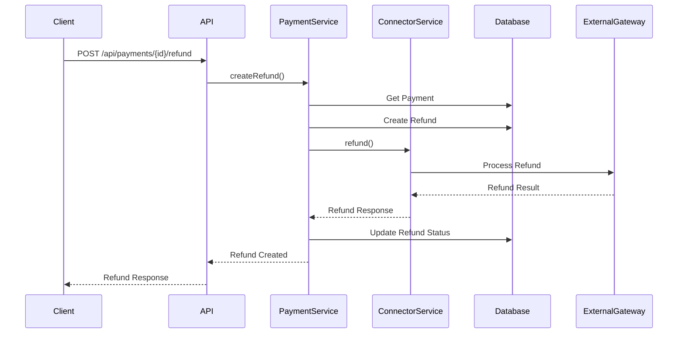
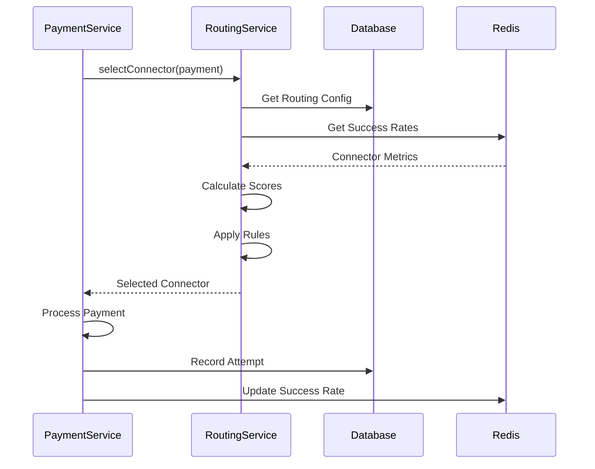
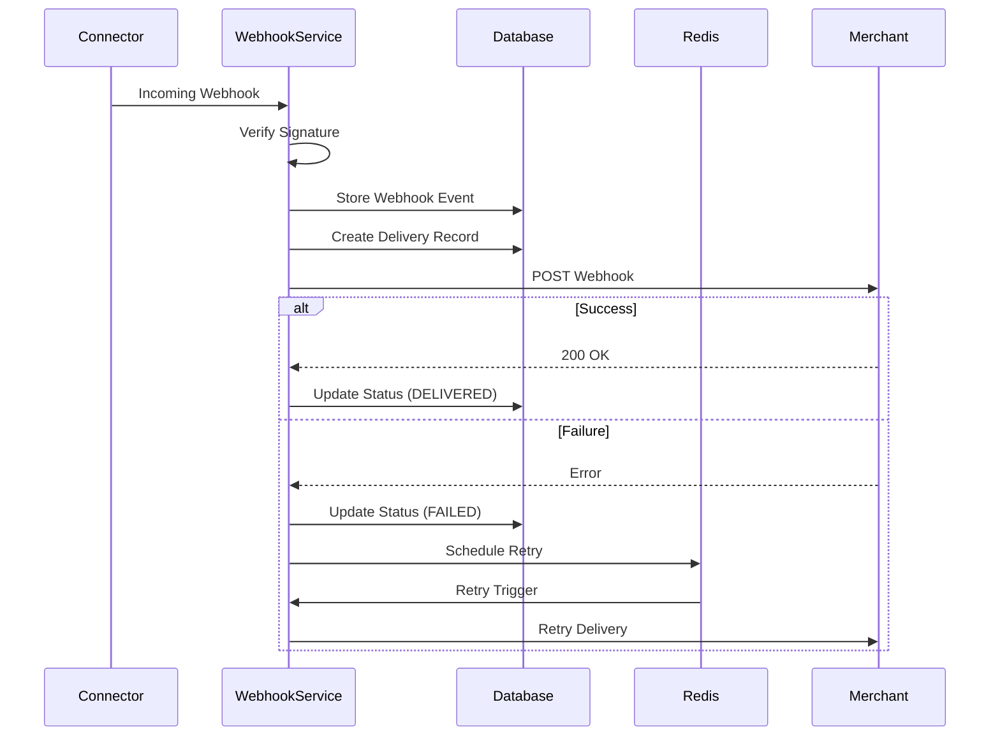
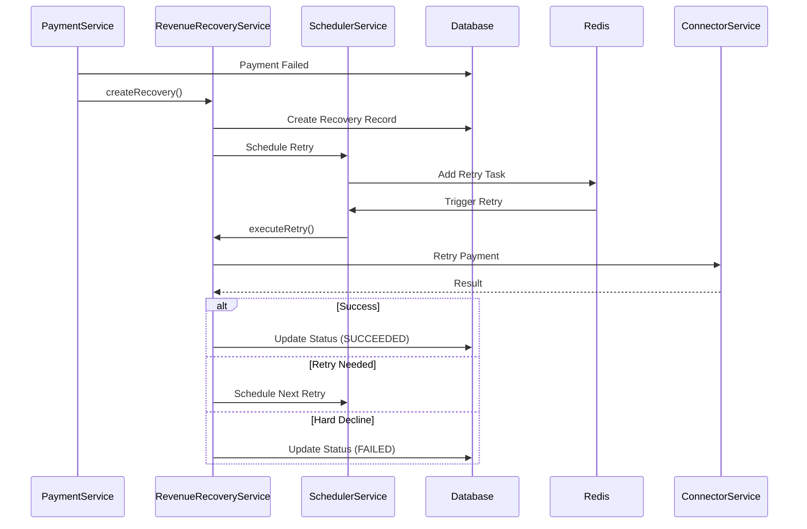

# Hyperswitch Payment Service - Java Implementation

A comprehensive Java Spring Boot implementation of [Hyperswitch](https://github.com/juspay/hyperswitch), an open-source payment switch. This service provides a complete payment processing platform with support for multiple payment methods, intelligent routing, fraud detection, and enterprise features.

## 📋 Table of Contents

- [Overview](#overview)
- [Architecture](#architecture)
- [Technology Stack](#technology-stack)
- [Project Structure](#project-structure)
- [Features](#features)
- [Prerequisites](#prerequisites)
- [Setup & Installation](#setup--installation)
- [Configuration](#configuration)
- [Running the Application](#running-the-application)
- [Testing](#testing)
- [API Documentation](#api-documentation)
- [Service Flows](#service-flows)
- [Development](#development)
- [Contributing](#contributing)
- [License](#license)

## 🎯 Overview

The Hyperswitch Payment Service is a reactive, enterprise-grade payment processing platform built with Spring Boot 3.4.1 and Java 25. It implements the core functionality of Hyperswitch, providing:

- **Multi-connector Support**: Unified interface for multiple payment processors
- **Intelligent Routing**: Success-rate-based, volume-based, and rule-based routing algorithms
- **3DS Authentication**: Complete 3DS 2.0 flow support
- **Recurring Payments**: Mandates and subscriptions with CIT/MIT flows
- **Fraud Detection**: Risk scoring and fraud checking
- **Revenue Recovery**: Advanced retry algorithms with workflow orchestration
- **Reconciliation**: 2-way and 3-way reconciliation with advanced reporting
- **Webhooks**: Secure webhook delivery with retry logic
- **Analytics**: Payment, refund, and connector analytics

## 🏗️ Architecture

### High-Level Architecture



### Module Architecture



## 🛠️ Technology Stack

### Core Technologies
- **Java**: 25 (LTS)
- **Spring Boot**: 3.4.1
- **Spring WebFlux**: Reactive web framework
- **R2DBC**: Reactive database connectivity (PostgreSQL)
- **Redis**: Caching and job queues
- **Maven**: Build and dependency management

### Key Libraries
- **Vavr**: Functional programming utilities
- **MapStruct**: DTO mapping
- **Micrometer**: Metrics and observability
- **OpenTelemetry**: Distributed tracing
- **SpringDoc OpenAPI**: API documentation
- **Logback**: Structured JSON logging

## 📁 Project Structure

```
paymentservice/
├── paymentservice-common/          # Shared utilities and types
│   ├── dto/                        # Data Transfer Objects
│   ├── enums/                      # Enumerations
│   ├── types/                      # Type definitions
│   ├── errors/                     # Error handling
│   ├── security/                   # Security utilities
│   └── validation/                 # Input validation
│
├── paymentservice-core/             # Core business logic
│   ├── payments/                   # Payment processing
│   ├── paymentmethods/             # Payment method management
│   ├── customers/                  # Customer management
│   ├── routing/                    # Routing algorithms
│   ├── mandates/                   # Recurring payments
│   ├── disputes/                   # Dispute management
│   ├── payouts/                    # Payout processing
│   ├── subscriptions/              # Subscription management
│   ├── fraudcheck/                 # Fraud detection
│   ├── revenuerecovery/            # Revenue recovery
│   ├── reconciliation/             # Reconciliation
│   ├── webhooks/                   # Webhook delivery
│   └── analytics/                  # Analytics
│
├── paymentservice-storage/         # Database layer
│   ├── entity/                     # JPA entities
│   ├── repository/                 # R2DBC repositories
│   └── resources/db/migration/    # Flyway migrations
│
├── paymentservice-connectors/       # Connector implementations
│   ├── ConnectorInterface.java      # Connector contract
│   ├── ConnectorService.java       # Connector management
│   └── impl/                        # Connector implementations
│
├── paymentservice-routing/          # Routing engine
│   ├── RoutingService.java         # Routing interface
│   └── impl/                       # Routing implementations
│
├── paymentservice-scheduler/        # Background jobs
│   └── impl/                       # Scheduler implementation
│
└── paymentservice-web/              # REST API layer
    ├── controller/                 # REST controllers
    ├── config/                     # Configuration
    └── resources/
        ├── application.yml         # Application configuration
        └── logback-spring.xml      # Logging configuration
```

## ✨ Features

### Core Payment Features ✅
- ✅ Payment Intent Creation & Confirmation
- ✅ Payment Capture (Full & Partial)
- ✅ Payment Cancellation
- ✅ Payment Updates
- ✅ Payment Retrieval
- ✅ Payment Listing with Filters
- ✅ Payment Aggregates
- ✅ Payment Attempt Listing

### 3DS Authentication ✅
- ✅ 3DS Challenge Handling
- ✅ 3DS Resume Flow
- ✅ 3DS Callback Processing
- ✅ 3DS Decision Rule Execution

### Payment Methods ✅
- ✅ Payment Method CRUD Operations
- ✅ Card Tokenization
- ✅ Network Token Status
- ✅ Payment Method Sessions (v2 API)
- ✅ Payment Method Listing & Filters

### Customers ✅
- ✅ Customer CRUD Operations
- ✅ Customer Listing with Pagination
- ✅ Customer Payment Methods
- ✅ Customer Mandates

### Refunds ✅
- ✅ Refund Creation (Full & Partial)
- ✅ Refund Listing with Filters
- ✅ Refund Sync
- ✅ Refund Aggregates
- ✅ Refund v2 API

### Mandates & Recurring Payments ✅
- ✅ Mandate Setup Flow
- ✅ Customer-Initiated Transactions (CIT)
- ✅ Merchant-Initiated Transactions (MIT)
- ✅ Mandate Expiration Handling
- ✅ Active Mandate Lookup

### Advanced Features ✅
- ✅ Incremental Authorization
- ✅ Extend Authorization
- ✅ Payment Void
- ✅ Approve/Reject Flows
- ✅ Payment Sessions (v2 API)
- ✅ Payment Redirect Flows
- ✅ Payment Sync (psync)
- ✅ Revenue Recovery
- ✅ Fraud Checking
- ✅ Reconciliation (2-way & 3-way)

### Enterprise Features ✅
- ✅ Intelligent Routing
- ✅ Webhook Delivery
- ✅ Subscriptions
- ✅ Payouts
- ✅ Disputes
- ✅ Payment Links
- ✅ Ephemeral Keys
- ✅ Authentication (Separate from Payments)
- ✅ Tokenization (v2 API)
- ✅ Verification (Apple Pay)
- ✅ Config Management
- ✅ File Management
- ✅ Cache Management
- ✅ Card Info Management
- ✅ Blocklist Management
- ✅ Poll Status

## 📋 Prerequisites

### Required Software
- **Java 25 JDK** - [Download](https://www.oracle.com/java/technologies/downloads/) or use [SDKMAN](https://sdkman.io/)
- **Maven 3.8+** - [Download](https://maven.apache.org/download.cgi)
- **PostgreSQL 14+** - [Download](https://www.postgresql.org/download/)
- **Redis 7+** - [Download](https://redis.io/download)

### Optional Software
- **Docker** - For containerized deployment
- **Postman** - For API testing
- **IntelliJ IDEA** or **Eclipse** - For development

## 🚀 Setup & Installation

### 1. Clone the Repository

```bash
git clone <repository-url>
cd Payment-service/paymentservice
```

### 2. Install Java 25

#### Using SDKMAN (Recommended)
```bash
# Install SDKMAN
curl -s "https://get.sdkman.io" | bash
source "$HOME/.sdkman/bin/sdkman-init.sh"

# Install Java 25
sdk install java 25.0.0-tem
sdk use java 25.0.0-tem
```

#### Manual Installation
Download Java 25 from Oracle and set `JAVA_HOME`:
```bash
export JAVA_HOME=/path/to/java-25
export PATH=$JAVA_HOME/bin:$PATH
```

### 3. Set Up PostgreSQL

```bash
# Start PostgreSQL (if not running)
# On macOS with Homebrew:
brew services start postgresql@14

# On Linux:
sudo systemctl start postgresql

# On Windows:
# Start PostgreSQL service from Services
```

Create database and user:
```sql
-- Connect to PostgreSQL
psql -U postgres

-- Create database
CREATE DATABASE hyperswitch_db;

-- Create user
CREATE USER db_user WITH PASSWORD 'db_pass';

-- Grant privileges
GRANT ALL PRIVILEGES ON DATABASE hyperswitch_db TO db_user;

-- Connect to the database
\c hyperswitch_db

-- Grant schema privileges
GRANT ALL ON SCHEMA public TO db_user;
```

### 4. Set Up Redis

```bash
# Start Redis
# On macOS with Homebrew:
brew services start redis

# On Linux:
sudo systemctl start redis

# On Windows:
# Download and run Redis from https://github.com/microsoftarchive/redis/releases

# Verify Redis is running
redis-cli ping
# Should return: PONG
```

### 5. Build the Project

```bash
# From the project root
mvn clean install

# Skip tests (if needed)
mvn clean install -DskipTests
```

## ⚙️ Configuration

### Application Configuration

Edit `paymentservice-web/src/main/resources/application.yml`:

```yaml
spring:
  r2dbc:
    url: r2dbc:postgresql://localhost:5432/hyperswitch_db
    username: db_user
    password: db_pass
  
  data:
    redis:
      host: localhost
      port: 6379
      password: # Leave empty if no password

server:
  port: 8080

hyperswitch:
  payment:
    max-retry-attempts: 3
    retry-delay-seconds: 5
  routing:
    enabled: true
    algorithm: SUCCESS_RATE_BASED
  connectors:
    webhooks:
      stripe:
        secret: ${STRIPE_WEBHOOK_SECRET:whsec_default_secret}
      adyen:
        secret: ${ADYEN_WEBHOOK_SECRET:}
      checkout:
        secret: ${CHECKOUT_WEBHOOK_SECRET:}
```

### Environment Variables

Create a `.env` file or set environment variables:

```bash
# Database
export DB_HOST=localhost
export DB_PORT=5432
export DB_NAME=hyperswitch_db
export DB_USER=db_user
export DB_PASSWORD=db_pass

# Redis
export REDIS_HOST=localhost
export REDIS_PORT=6379
export REDIS_PASSWORD=

# Webhook Secrets
export STRIPE_WEBHOOK_SECRET=whsec_your_secret
export ADYEN_WEBHOOK_SECRET=your_secret
export CHECKOUT_WEBHOOK_SECRET=your_secret

# Security
export API_KEY_ENABLED=true
export CSRF_ENABLED=false
```

## 🏃 Running the Application

### Development Mode

```bash
# From the project root
cd paymentservice-web
mvn spring-boot:run

# Or from root with profile
mvn spring-boot:run -pl paymentservice-web
```

### Production Mode

```bash
# Build JAR
mvn clean package -DskipTests

# Run JAR
java -jar paymentservice-web/target/paymentservice-web-1.0.0-SNAPSHOT.jar

# With profile
java -jar paymentservice-web/target/paymentservice-web-1.0.0-SNAPSHOT.jar --spring.profiles.active=prod
```

### Docker (Optional)

```bash
# Build Docker image
docker build -t hyperswitch-payment-service .

# Run container
docker run -p 8080:8080 \
  -e SPRING_R2DBC_URL=r2dbc:postgresql://host.docker.internal:5432/hyperswitch_db \
  -e SPRING_DATA_REDIS_HOST=host.docker.internal \
  hyperswitch-payment-service
```

### Verify Application is Running

```bash
# Health check
curl http://localhost:8080/health

# API documentation
open http://localhost:8080/swagger-ui.html

# Metrics
curl http://localhost:8080/actuator/metrics
```

## 🧪 Testing

### Manual Testing

#### 1. Create a Payment

```bash
curl -X POST http://localhost:8080/api/payments \
  -H "Content-Type: application/json" \
  -H "X-Merchant-Id: merchant_123" \
  -d '{
    "amount": 1000,
    "currency": "USD",
    "description": "Test payment",
    "return_url": "https://example.com/return"
  }'
```

#### 2. Confirm a Payment

```bash
curl -X POST http://localhost:8080/api/payments/{payment_id}/confirm \
  -H "Content-Type: application/json" \
  -H "X-Merchant-Id: merchant_123" \
  -d '{
    "payment_method_id": "pm_123",
    "customer_id": "cus_123"
  }'
```

#### 3. Get Payment Status

```bash
curl -X GET http://localhost:8080/api/payments/{payment_id} \
  -H "X-Merchant-Id: merchant_123"
```

### Using Swagger UI

1. Open http://localhost:8080/swagger-ui.html
2. Browse available endpoints
3. Try out endpoints directly from the UI
4. View request/response schemas

### Postman Collection

Import the API endpoints into Postman:
- Base URL: `http://localhost:8080`
- Headers: `X-Merchant-Id: merchant_123`

### Integration Tests (To Be Implemented)

```bash
# Run all tests
mvn test

# Run specific test class
mvn test -Dtest=PaymentServiceTest

# Run with coverage
mvn test jacoco:report
```

## 📚 API Documentation

### Swagger UI

Access interactive API documentation at:
- **Swagger UI**: http://localhost:8080/swagger-ui.html
- **OpenAPI JSON**: http://localhost:8080/api-docs

### API Endpoints Overview

#### Payment Operations
- `POST /api/payments` - Create payment
- `POST /api/payments/{id}/confirm` - Confirm payment
- `POST /api/payments/{id}/capture` - Capture payment
- `GET /api/payments/{id}` - Get payment status
- `POST /api/payments/{id}/refund` - Process refund
- `GET /api/payments/list` - List payments with filters
- `GET /api/payments/filter` - Get payment filters
- `GET /api/payments/aggregate` - Get payment aggregates

#### Payment Intent (v2 API)
- `POST /api/v2/payments/create-intent` - Create payment intent
- `GET /api/v2/payments/{id}/get-intent` - Get payment intent
- `PUT /api/v2/payments/{id}/update-intent` - Update payment intent
- `POST /api/v2/payments/{id}/confirm-intent` - Confirm payment intent

#### Customer Management
- `POST /api/customers` - Create customer
- `GET /api/customers/{id}` - Get customer
- `POST /api/customers/{id}` - Update customer
- `DELETE /api/customers/{id}` - Delete customer
- `GET /api/customers` - List customers

#### Payment Methods
- `POST /api/payment_methods` - Create payment method
- `GET /api/payment_methods/{id}` - Get payment method
- `POST /api/payment_methods/tokenize-card` - Tokenize card
- `GET /api/payment_methods` - List payment methods

#### Refunds
- `POST /api/payments/{id}/refund` - Create refund
- `POST /api/refunds/list` - List refunds
- `GET /api/refunds/{id}` - Get refund
- `POST /api/refunds/sync` - Sync refund

#### Webhooks
- `POST /api/webhooks/{connector}` - Incoming webhook
- `GET /api/webhooks/events/{eventId}` - Get webhook status
- `POST /api/webhooks/events/{eventId}/retry` - Retry webhook

See [IMPLEMENTATION_SUMMARY.md](./IMPLEMENTATION_SUMMARY.md) for complete API reference.

## 🔄 Service Flows

### Payment Flow



### 3DS Authentication Flow



### Refund Flow



### Intelligent Routing Flow



### Webhook Delivery Flow



### Revenue Recovery Flow



## 💻 Development

### Code Style

The project follows Java best practices:
- Reactive programming patterns (WebFlux, R2DBC)
- Functional error handling with `Result<T, E>` type
- Type-safe error handling
- Clean code principles
- SonarQube compliance

### Adding a New Feature

1. **Create Entity** (if needed)
   ```java
   // paymentservice-storage/src/main/java/.../entity/NewEntity.java
   ```

2. **Create Repository**
   ```java
   // paymentservice-storage/src/main/java/.../repository/NewRepository.java
   ```

3. **Create Service Interface**
   ```java
   // paymentservice-core/src/main/java/.../newfeature/NewService.java
   ```

4. **Implement Service**
   ```java
   // paymentservice-core/src/main/java/.../newfeature/impl/NewServiceImpl.java
   ```

5. **Create Controller**
   ```java
   // paymentservice-web/src/main/java/.../controller/NewController.java
   ```

6. **Add Database Migration**
   ```sql
   -- paymentservice-storage/src/main/resources/db/migration/V28__create_new_table.sql
   ```

### Running Tests

```bash
# Unit tests
mvn test

# Integration tests
mvn verify

# With coverage
mvn test jacoco:report
```

### Debugging

```bash
# Run with debug port
mvn spring-boot:run -Dspring-boot.run.jvmArguments="-Xdebug -Xrunjdwp:transport=dt_socket,server=y,suspend=n,address=5005"

# Attach debugger to port 5005
```

## 📊 Monitoring & Observability

### Health Checks

```bash
# Basic health
curl http://localhost:8080/health

# Detailed health
curl http://localhost:8080/actuator/health

# Database health
curl http://localhost:8080/actuator/health/db

# Redis health
curl http://localhost:8080/actuator/health/redis
```

### Metrics

```bash
# All metrics
curl http://localhost:8080/actuator/metrics

# Specific metric
curl http://localhost:8080/actuator/metrics/http.server.requests

# Prometheus format
curl http://localhost:8080/actuator/prometheus
```

### Logging

Logs are structured in JSON format:
```json
{
  "timestamp": "2025-01-20T10:00:00.000Z",
  "level": "INFO",
  "logger": "com.hyperswitch.core.payments.PaymentServiceImpl",
  "message": "Payment created",
  "payment_id": "pay_123",
  "merchant_id": "merchant_123"
}
```

## 🤝 Contributing

1. Fork the repository
2. Create a feature branch (`git checkout -b feature/amazing-feature`)
3. Commit your changes (`git commit -m 'Add amazing feature'`)
4. Push to the branch (`git push origin feature/amazing-feature`)
5. Open a Pull Request


## 🔗 References

- [Hyperswitch GitHub](https://github.com/juspay/hyperswitch)
- [Hyperswitch Documentation](https://docs.hyperswitch.io)
- [Spring Boot Documentation](https://spring.io/projects/spring-boot)
- [R2DBC Documentation](https://r2dbc.io/)
- [Spring WebFlux Documentation](https://docs.spring.io/spring-framework/reference/web/webflux.html)

## 📞 Support

For issues and questions:
- Open an issue on GitHub
- Check [IMPLEMENTATION_SUMMARY.md](./IMPLEMENTATION_SUMMARY.md) for feature status
- Review API documentation at `/swagger-ui.html`

---

**Last Updated:** 2025-01-20  
**Version:** 1.0.0-SNAPSHOT

